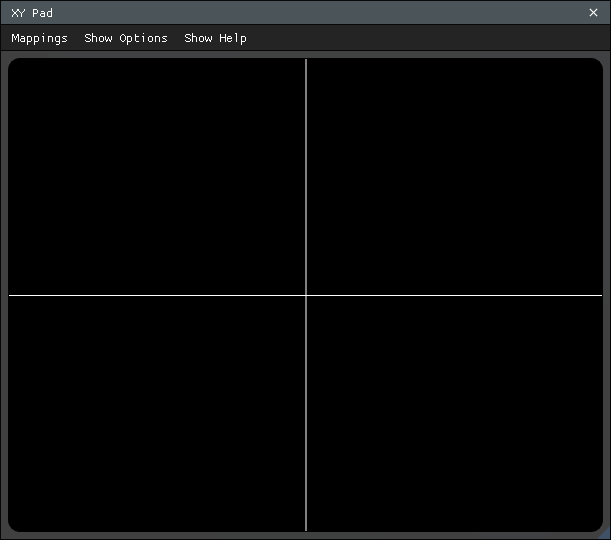
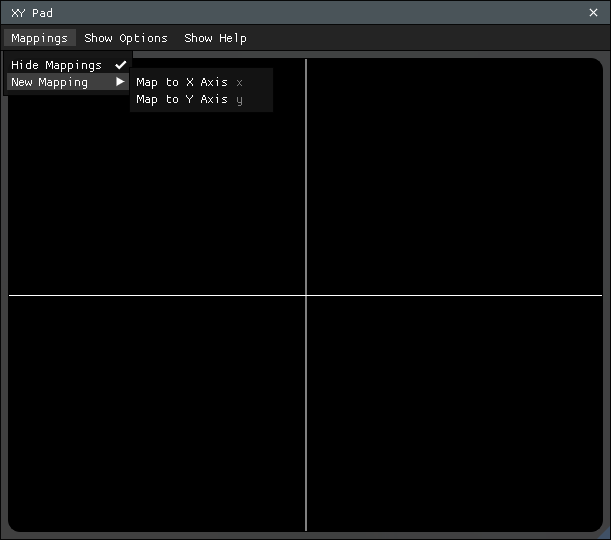
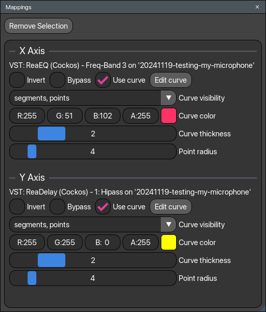
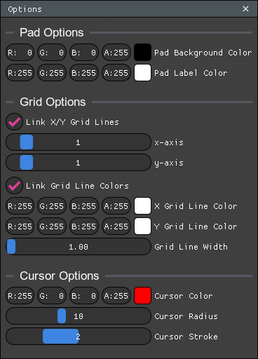

# XY Pad

### Overview
XY Pad, by [Tech Audio](https://techaud.io/), is an interactive control script that can map and manipulate plugin parameters across an XY Pad.

- [Prerequisites](#prerequisites)
- [Installation](#installation)
- [Main Scripts](#main-scripts)
- [UI Layout](#ui-layout)
    - [XY Pad Window](#xy-pad-window)
    - [Mappings Window](#mappings-window)
    - [Options Window](#options-window)
- [How To Use](#how-to-use)
    - [Mapping Parameters](#mapping-parameters)
    - [Manipulate Parameters](#manipulate-parameters)
    - [Shaping Parameter Response with Curves](#shaping-parameter-response-with-curves)

### Prerequisites
- [ReaPack](https://reapack.com/), a package manager for REAPER
- [ReaImGui API](https://github.com/cfillion/reaimgui) available via ReaPack

<PageBreak />

### Installation
1. Install [ReaPack](https://reapack.com/) if you haven't already
2. Open REAPER and go to `Extensions` > `ReaPack` > `Manage repositories...`
3. Add the Tech Audio repository URL: `https://github.com/TeamAudio/reascripts/raw/main/index.xml`
4. Go to `Extensions` > `ReaPack` > `Browse packages...`
5. Search for `XY Pad` and select it from the list
6. Click the `Install` button to install the script and its dependencies
7. Once installed, you can find the script in the `Actions` list under `TA_XY Pad`

<PageBreak />

### Main Scripts
XY Pad consists of a main control script, and 3 component scripts:
- TA_XY Pad.lua
    - Main control script. Renders the `XY Pad` and `Mappings` windows
- TA_XY Pad Set X.lua
    - Links last touched plugin parameter to the X axis
- TA_XY Pad Set Y.lua
    - Links last touched plugin parameter to the Y axis
- TA_XY Pad Full Reset.lua
    - Deletes all saved mappings and resets `TA_XY Pad.lua` to an initial state

<PageBreak />

## UI Layout
### XY Pad Window
This is where you control parameters you've mapped to the pad by clicking and dragging your cursor within the grid boundaries. Parameters mapped to the X axis will have their values determined based on a factor ranging between 0 on the left edge and 1 on the right. Parameters mapped to the Y axis work similarly, with 0 at the bottom edge and 1 at the top.

Each mapping's response curve is drawn on the pad in the mapping's color, so you can see at a glance how pad position translates into parameter values (see [Shaping Parameter Response with Curves](#shaping-parameter-response-with-curves)).

<PageBreak />

### Main menu items

- `Mappings`
    - `Show/Hide Mappings` opens the `Mappings` window
    - `New Mapping` submenu items to map plugin parameters to the X or Y axis
- `Show/Hide Options`
    - Opens and closes the `Options` window to change the colors, grid setup, and other appearance settings of XY Pad
- `Show/Hide Help`
    - Shows and hides the tutorial text that is shown on first startup

<PageBreak />

### Mappings Window
This window lets you monitor which parameters are mapped, shape each mapping's response curve, invert the controls, or bypass controls entirely.

- Available mapping options
    - `Invert`
        - Inverts the value XY Pad sends, after the response curve is applied
    - `Bypass`
        - Bypasses the selected plugin parameter from being affected by XY Pad
    - `Use curve`
        - Toggles whether the mapping's response curve is applied; the curve's shape is kept while disabled
    - `Edit curve`
        - Puts the mapping's curve into edit mode on the pad (see [Shaping Parameter Response with Curves](#shaping-parameter-response-with-curves))
    - `Curve visibility`
        - Choose whether the curve's segments and/or points are drawn on the pad
    - `Curve color`, `Curve thickness`, `Point radius`
        - Appearance of the curve on the pad, per mapping

<PageBreak />

### Options Window
Here, you can change aesthetic properties of XY Pad. Number of gridlines, colors, just about everything!

- Pad Options
    - Change the pad background color and the pad's lower-left corner label color
- Grid Options
    - Change the number of horizontal and vertical gridlines that occupy the pad
        - `Link X/Y Grid Lines` change values at the same time
    - Change gridline colors
        - `Link Grid Line Colors`
    - Change gridline width
        - Change thickness of the gridlines
- Cursor Options
    - `Cursor Color`
        - Change the color of the circular cursor that shows when clicking and dragging on the pad
    - `Cursor Radius`
        - Change the size of the circular cursor
    - `Cursor Stroke`
        - Change the thickness of the circular cursor
- Curve Options
    - `Transpose Y curve` (per project)
        - When enabled (the default), Y-axis mapping curves are transposed on the pad so their input runs bottom-to-top, matching the axis they control

<PageBreak />

## How to Use
### Mapping Parameters
XY Pad allows you to map a parameter by running one of its accessory actions (TA_XY Pad Set X.lua and TA_XY Pad Set Y.lua) or by activating a training mode directly inside of the plugin.

If you'd like to map a global shortcut to assign parameters to the pad, use one of the accessory scripts:

1. Click on the plugin parameter you'd like to assign to the pad.
2. With the main TA_XY Pad.lua running, run either the TA_XY Pad Set X.lua or TA_XY Pad Set Y.lua action to map that parameter to the X or Y axis respectively.

If you'd prefer to do this from XY Pad directly, you can!

1. Invoke the training mode from the main window by selecting New Mapping -> Map to X Axis or New Mapping -> Map to Y Axis from the Mappings menu. Keyboard shortcuts "x" and "y" are also available to trigger the same behavior.
2. Click on the plugin parameter you'd like to assign to the pad.

You should see your mapped parameter appear in the Mappings window under the chosen axis.

Both modes leverage REAPER's GetTouchedOrFocusedFX() ReaScript function to determine the last parameter that you interacted with. This can be a somewhat quirky experience in practice, for example if you've already mapped a parameter and attempt to map it again. XY Pad will do its best in training mode to describe any situation preventing a mapping based on this value, displaying messages like "No tracks in project", "No FX in project" or "Touch an unmapped parameter to map it to the pad."

<PageBreak />

### Manipulate Parameters
- On the main `XY Pad` window, values (0, 0) is the bottom left corner, and (1, 1) is the top right corner
- Clicking and dragging your mouse across the Pad will move the plugin parameters between the **minimum-most** value and **maximum-most** value *for that particular plugin* by default
    - Each mapping's response curve shapes how pad position translates into parameter values — see the next section

<PageBreak />

### Shaping Parameter Response with Curves
Every mapping has an editable response curve that maps pad position (input) to parameter value (output). By default it is a straight line: pad position passes through unchanged.

Editing a curve:
- Click `Edit curve` on a mapping in the Mappings window to edit its curve on the pad
- `Right-click` anywhere on the pad to add a point
- `Right-click and drag` a point to move it
- `Alt + Right-click` a point to remove it
- The first and last points are pinned to the pad edges; drag them to limit the range of values the mapping produces

Related controls:
- `Use curve` toggles the curve on and off without discarding its shape
- `Curve visibility`, `Curve color`, `Curve thickness` and `Point radius` control how the curve is drawn on the pad
- `Invert` checkbox flips the value XY Pad sends after the curve is applied, meaning (0, 0) is now the ***top-right*** corner, and (1, 1) is the ***bottom-left*** corner
- `Bypass` checkbox switches on and off the manipulation of the plugin's parameter by the XY Pad
- For Y-axis mappings the curve is drawn transposed by default so its input runs bottom-to-top; this can be disabled per project with `Transpose Y curve` in the Options window

Upgrading from XY Pad 1.0: the `Max`/`Min` sliders have been replaced by curve endpoints. Projects saved with custom bounds are migrated automatically — the mapping sounds exactly the same, and the old range is now visible and editable as the curve itself.
